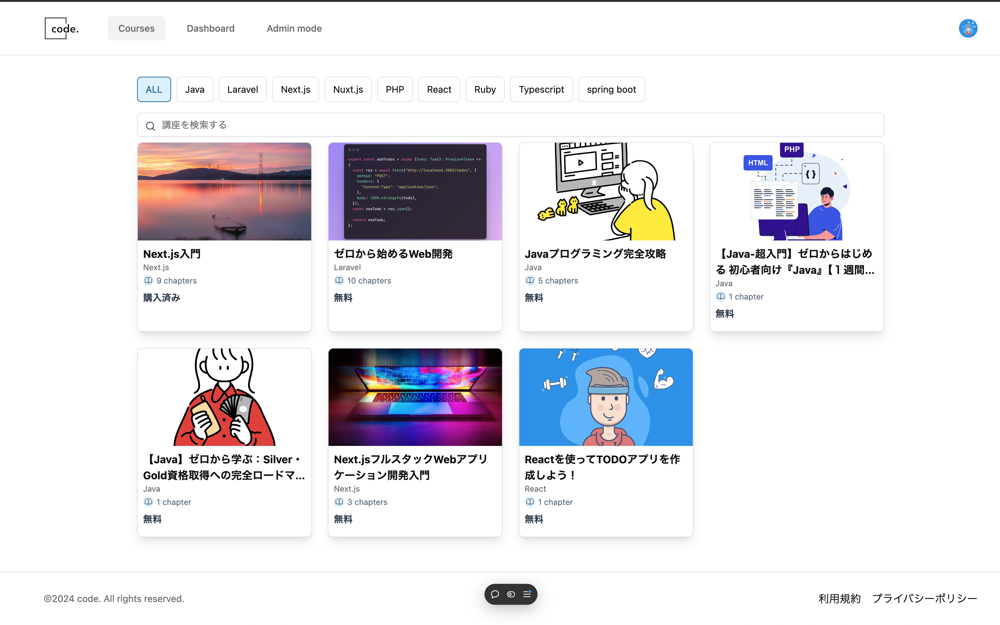

こちらは「code.」のリポジトリです。

# code. / プログラミング学習サービス

## サービス概要

「code.」は「プログラミングをもっと身近に」という想いから作られた、プログラミング学習サービスです。

現役エンジニアが、プログラミング学習に役立つ情報を提供し、学習者がより効率的にプログラミングを学ぶことを目的としています。

### ▼ サービス URL

https://code-dot-nine.vercel.app

レスポンシブ対応済のため、PC でもスマートフォンでも快適にご利用いただけます。

### ▼ 紹介記事(zenn)

TODO : 記事の追加  
開発背景や、サービスのリリースまでに勉強したことなどをまとめています。

### ▼ 開発者 Twitter

TODO : Twitter のリンクを追加

何かあれば、こちらまでお気軽にご連絡ください。

## 使用技術一覧

バックエンド： Hono 4.6.7  
・コード解析：ESLint  
・フォーマッター：Prettier  

フロントエンド：TypeScript 5.0.0 / React 18.0.0 / Next.js 14.0.4  
・コード解析：ESLint  
・フォーマッター：Prettier  

CSS フレームワーク：Tailwind CSS  
主要パッケージ：React Query  
インフラ：Vercel

CI / CD：GitHub Actions

認証: clerk
