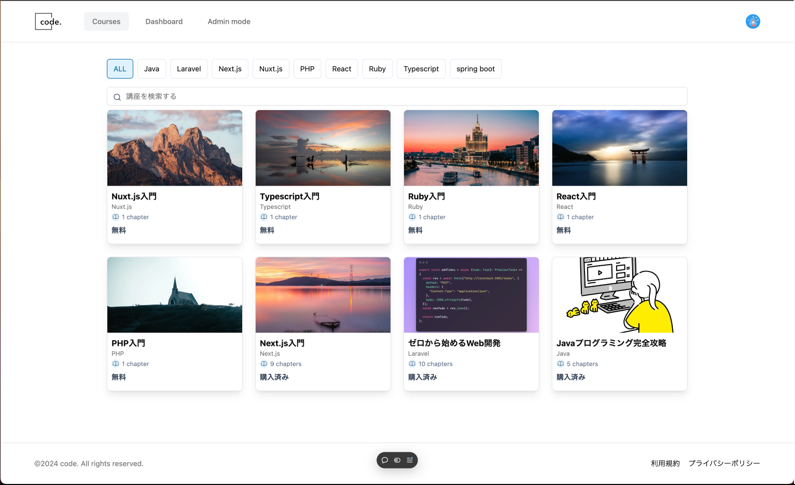
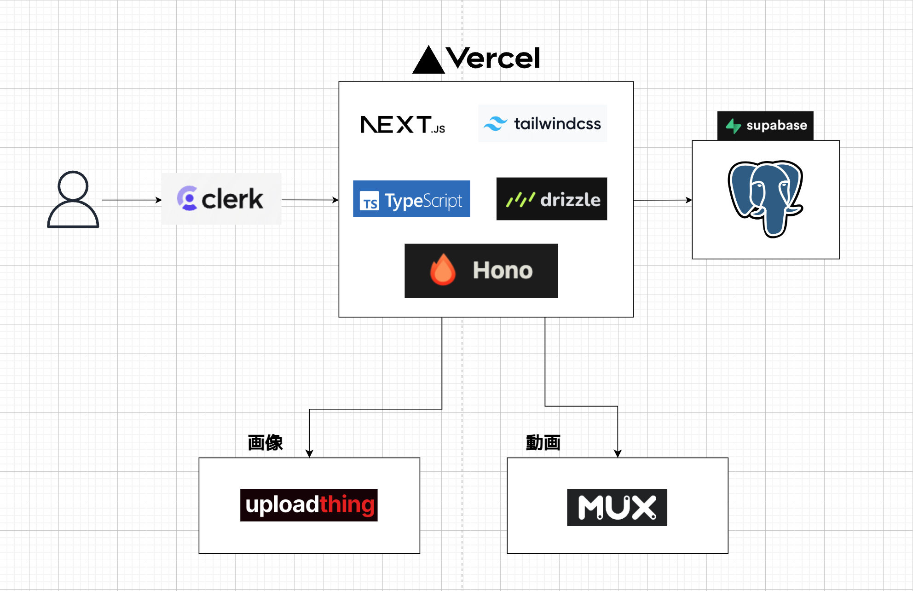
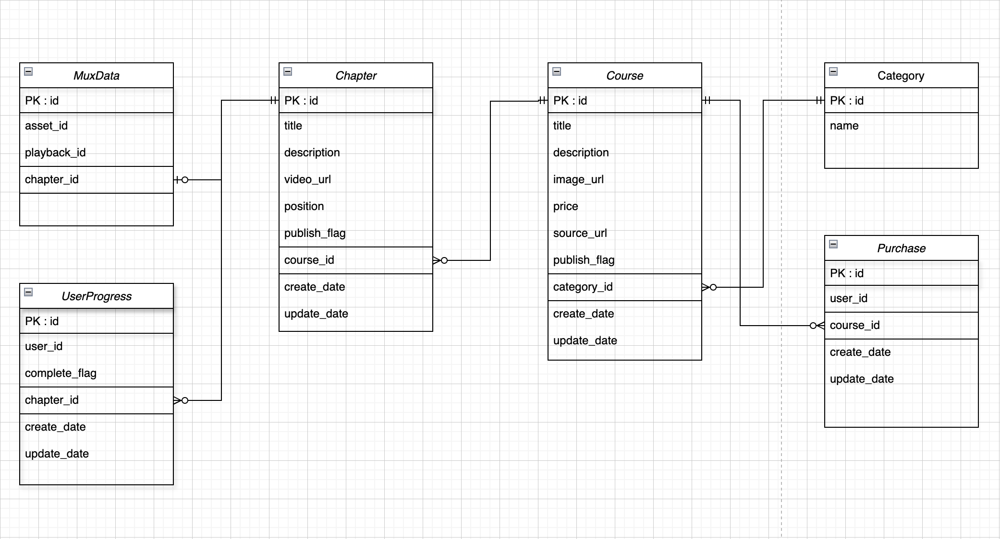

こちらは「code.」のリポジトリです。

# code. / プログラミング学習サービス

## サービス概要

自分専用の udemy のようなプログラミング動画学習サービスを作成したいと思い、「code.」というサービスを開発しました。（まだサンプル用の講座しかありませんが、、、）今回、モダンな技術を使って作成したので、開発背景や使用した技術を紹介していきます。

### ▼ サービス URL

https://code-dot-nine.vercel.app

レスポンシブ対応済のため、PC でもスマートフォンでも快適にご利用いただけます。

### ▼ 紹介記事(zenn)

TODO : 記事の追加  
開発背景や、使用した技術についてまとめています。

### ▼ 開発者 Twitter

https://x.com/crypto__rei

何かあれば、こちらまでお気軽にご連絡ください。

## 使用技術一覧

バックエンド： Hono 4.6.7  
・コード解析：ESLint  
・フォーマッター：Prettier  

フロントエンド：TypeScript 5.0.0 / React 18.0.0 / Next.js 14.0.4  
・コード解析：ESLint  
・フォーマッター：Prettier  

CSS フレームワーク：Tailwind CSS  
主要パッケージ：React Query  
インフラ：Vercel

CI / CD：GitHub Actions

認証: clerk

## 主要機能一覧

### 機能

- メールアドレスとパスワードを利用したユーザー登録 / ログイン機能
- Google アカウントを利用したユーザー登録 / ログイン機能
- Github アカウントを利用したユーザー登録 / ログイン機能
- パスワード再設定機能
- 退会機能
- 講座の作成/編集/削除機能（管理者のみ）
- 講座の公開/非公開機能（管理者のみ）
- チャプターの作成/編集/削除機能（管理者のみ）
- チャプターの公開/非公開機能（管理者のみ）
- 講座の検索機能
- 講座の購入機能
- 画像の取得/アップロード機能
- 動画の取得/アップロード機能

### 画面

- トースト表示
- ローディング表示
- 404 エラー画面
- 500 エラー画面
- レスポンシブデザイン

## アーキテクチャ

## ER 図

